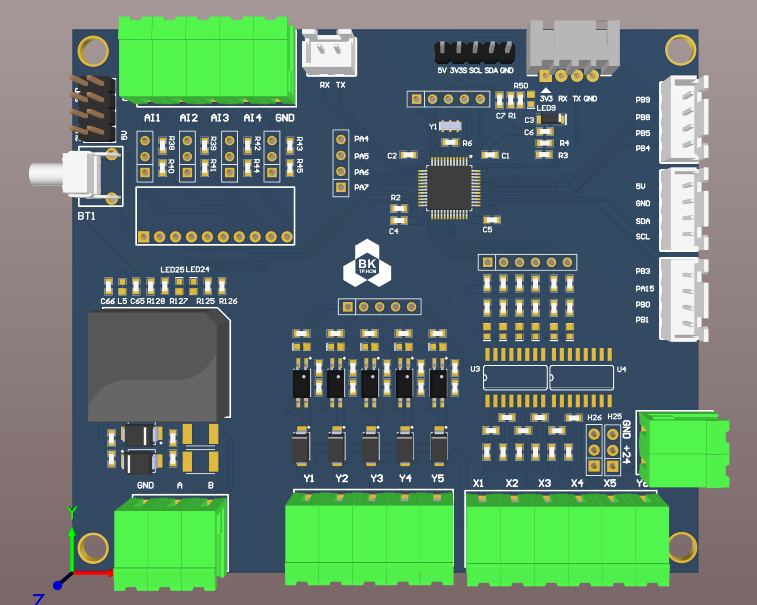

# IIOT STM32 Extension Board

👋 Welcome to the **IIOT STM32 Extension Board** project! This board is designed as an extension layer for the IIOT ESP32 system, leveraging the STM32F103 microcontroller to expand processing capabilities and enhance IIOT (Industrial Internet of Things) applications. Developed in Altium Designer 21, this board complements the ESP32 by providing additional computational power and peripheral support for complex industrial tasks.

## 📌 Project Overview

The **IIOT STM32 Extension Board** works alongside the ESP32 in IIOT applications, providing robust processing power and peripheral control through the STM32F103. This setup enables reliable real-time data processing, sensor integration, and control for industrial applications.

### 🔧 Key Features
- **Microcontroller**: STM32F103, known for its high performance and low power consumption in industrial environments.
- **Extension for ESP32**: Seamlessly connects with the IIOT ESP32 board, expanding its processing and I/O capabilities.
- **Rich Peripheral Interface**: Supports multiple interfaces such as I2C, SPI, UART, and ADC for sensor and actuator integration.
- **Real-Time Processing**: Ideal for handling real-time tasks in industrial settings with demanding requirements.
- **Durable Design**: Suitable for industrial environments, with protection against interference and optimized power management.

### 📋 Specifications
- **Board Name**: IIOT STM32 Extension Board
- **Microcontroller**: STM32F103
- **Interfaces**: I2C, SPI, UART, ADC, GPIO
- **Power Supply**: Compatible with standard 3.3V and 5V inputs
- **Communication**: Designed to work in tandem with the ESP32 for IIOT applications

## 📷 Board Images

| View        | Image                             |
|-------------|-----------------------------------|
| **Top View**    |       |
| **Frontleft View** |  |
| **Layout Top**    |       |
| **Layout Bottom** |  |
## 🚀 Getting Started
To begin using the **IIOT STM32 Extension Board**:
1. Connect the board to the **IIOT ESP32** using the provided interface connectors.
2. Load firmware onto the STM32F103 to handle specific tasks (e.g., sensor data collection, signal processing).
3. Configure the ESP32 to communicate with the STM32F103, enabling collaborative data processing and control.
4. Power the setup and begin testing in your IIOT application environment.

## 🛠 Usage Examples
1. **Data Aggregation**: Use the STM32 to collect and preprocess sensor data, sending processed information to the ESP32 for further actions.
2. **Real-Time Control**: Manage real-time control tasks, such as motor control or valve operation, where low latency is required.
3. **Peripheral Management**: Leverage the STM32’s GPIO, ADC, and communication interfaces to integrate additional sensors and actuators, expanding the IIOT system's capabilities.

---

🔗 **See Also**  
- [STM32F103 Datasheet](https://www.st.com/resource/en/datasheet/stm32f103c8.pdf)
- [ESP32 Documentation](https://www.espressif.com/en/products/socs/esp32)
- [Altium Designer 21 Documentation](https://www.altium.com/documentation/altium-designer/)
## Contact

For any questions or additional support, feel free to reach out:

- **Name**: Mai Xuan Canh
- **University**: Ho Chi Minh City University of Technology (HCMUT)
- **Major**: Control and Automation Engineering
- **LinkedIn**: [Canh Mai's LinkedIn](https://www.linkedin.com/in/maixuancanh2003/)
- **Email**: canhmai.work@gmail.com

---

